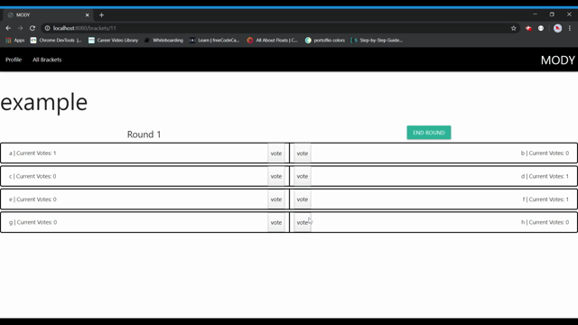

# MODY

## A fullstack application that allows user to create, vote on, and update bracket tournaments. 

Brackets are a useful and fun way to run contests and gauge public opinion. Our application allows users to both create brackets and vote on other user brackets. It features a responsive user interface built with Materialize and powered by jQuery and Sequelize. This application was built by a small team in one week.

## Table of Contents

* [Installation](#installation)
* [Usage](#usage)
* [Credits](#credits)
* [License](#license)

## Installation

To use this application, follow the link on the repository page; otherwise, you can [click here](https://modybrackets.herokuapp.com/).

## Usage 

Upon opening the application, you can either login or signup with an existing username and password. When you create an account or login, you will be redirected to your profile page.

Brackets can be easily created by clicking a button and filling out a short form. Simply enter the name of your bracket and the options. Currently, the application supports 8 contenders in each bracket. 

Upon viewing a bracket, each option in a matchup will be displayed next to the other. To vote for an option, just click on the "vote" button for the option you are voting for. You may only vote for one option per matchup once. 

To advance the brackets to the next round, click on the "next round" buttons. When you are ready to close a bracket and declare a winner, click the "close bracket" button.  

## Credits

Built with [Materialize](https://materializecss.com/).

NPM packages used: 
* [Express Handlebars](https://www.npmjs.com/package/express-handlebars)
* [@handlebars/allow-prototype-access](https://www.npmjs.com/package/@handlebars/allow-prototype-access)
* [MySQL](https://www.npmjs.com/package/mysql)
* [Node MySQL 2](https://www.npmjs.com/package/mysql2)
* [Sequelize](https://www.npmjs.com/package/sequelize)
* [Express](https://www.npmjs.com/package/express)
* [express-session](https://www.npmjs.com/package/express-session)
* [Connect Session Store using Sequelize](https://www.npmjs.com/package/connect-session-sequelize)
* [dotenv](https://www.npmjs.com/package/dotenv)
* [bcrypt](https://www.npmjs.com/package/bcrypt)

## License

Copyright © 2020 Megan Jacobs, Olga Sadova, Devin Heigert, and Yared Anbesie